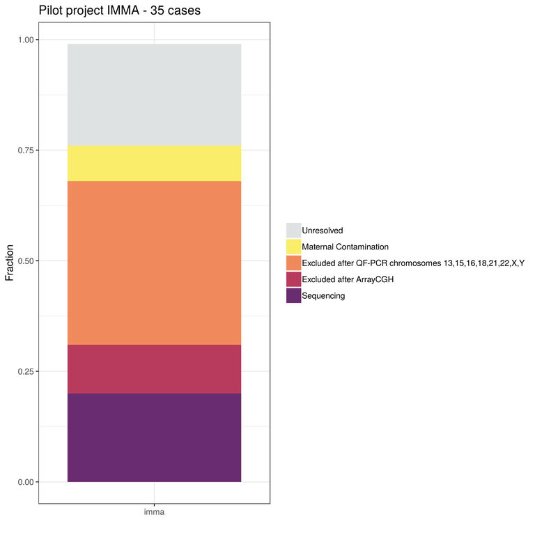
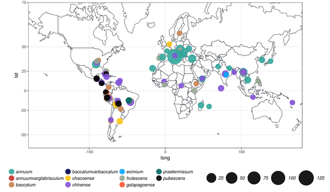

= Colonna Lab
:sectnums:
:toc: left
:toclevels: 4
:toc-title: My Content
:imagedir: images/

Welcome to the Population Genomics Laboratory of the Institute of Genetics and Biophysics.
We are interested in understanding causes and consequences of genetic diversity and how natural selection in humans affects loci related to diseases

== Research

=== Genomics of Recurrent Pregnancy Loss (GReP)

Approximately 70% of all human fertilizations are naturally aborted, with most occurring before the mother knows she is pregnant. Miscarriages that occur later in pregnancy are often due to non-viable genetic variation and this is very likely in the case of Recurrent Pregnancy Losses (RPL).

Numerical and structural chromosomal abnormalities are routinely investigated to understand causes of RPL, while the study of small-size sequence variants that can impact gene function has been neglected, leaving a whole range of possible causes unexplored.

This project will identify variants severely disrupting genes and regulatory functions, therefore incompatible with life, using whole genome sequence of DNA extracted from chorionic villi of miscarriages collected from women with RPL.

We will identify the highly deleterious dominant mutations as well as rare moderately to highly deleterious recessive mutations that constitute the genetic load of human populations and contribute to miscarriage. Participant inclusion criteria (e.g. recurrence, consanguinity, selection of comorbidities) will ensure the prevalence of genetic over environmental causes, and pre-sequencing screening will exclude cases with large chromosomal aberration.

.We are interestd in sequencing euploid miscarriages, therfore we do a pre-sequencing screening to exclude aneuploidies and comorbidity. We estimated that 20% of collected samples is euploid. We also find that with current methods it is not possible to make a diagnosis in about 25% of the samples.
[#img-preSeq_screaning]
[caption="Figure 1.1: ",link=https://github.com/GianlucaDamaggio/testWebPage/blob/master/image/preSeq_screaning.png]

This project is in collaboration with:

- https://www.monash.edu.my/science/staff/academic/qasim-ayub[Qasim Ayub], Monash University, Malaysia

- http://docente.unife.it/michele.rubini[Michele Rubini], University of Ferrara

- https://mpba.fbk.eu/furlanello[Cesare Furlanello], Fondazione Bruno Kessler

REPROS is funded by https://www.merigen.it/[Merigen Research s.r.l].

=== Genetics of fruit shape and size in peppers
Capsicum fruits are among the most-widely consumed vegetable crops in the world, and one of the most extensively domesticated plants. While a focus of breeding programs and widely studied for its beneficial properties, the genetics of pepper has been studied mostly by linkage analysis and with the use of coarse sets of markers and low resolution phenotypic data.

We discovered 746k high quality polymorphic sites analyzing sequence data of 373 pepper accessions. We also measured thirty-eight fruit shape and size attributes in 220 C. annuum accessions.We used these data to:

(i) uncover genomic properties of the pepper genome

(ii) describe population structure within the Capsicum genus at a resolution never achieved before

(iii) study natural selection,

(iv) discover significant association between genetic markers and traits related to pepper fruit shape and size in C. annuum, including a non-synonymous change in the sequence of longifolia 1-like gene associated with variance in fruit elongation.

.Our collection includes 373 pepper accessions from eleven species from 51 countries. It covers all the economically important species of Capsicum widely used in breeding programs, representing the largest study so far in terms of number of species and number of genetic variants analyzed.
[#img-capsicum]
[caption="Figure 1.2: ",link=https://github.com/GianlucaDamaggio/testWebPage/blob/master/image/preSeq_screaning.png]

This project is a collaboration with Pasquale Tripodi and Nunzio D'Agostino at http://sito.entecra.it/portale/cra_dati_istituto.php?id=207[CREA]

>> See our https://www.biorxiv.org/content/10.1101/487165v2[preprint] on bioRxive!! <<

>> Go to the project https://ezcn.github.io/Capsicum-genomics/[website]! <<

== People

=== Vincenza Colonna

=== Silvia Buonaiuto

=== Gianluca Damaggio

=== Flavia Villani

=== Giuliana D'angelo
